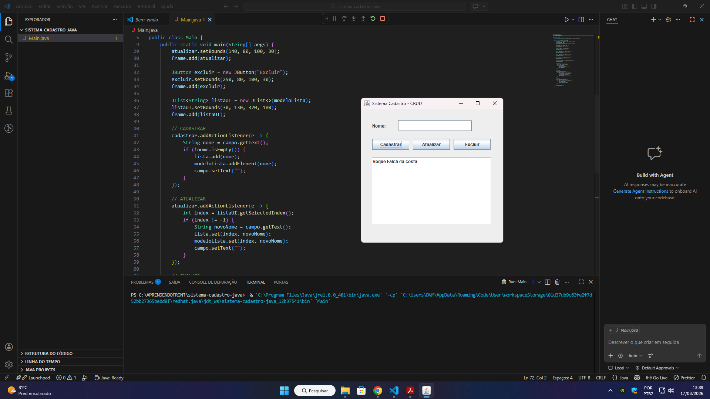

# 🔧 Sistema Cadastro Java - CRUD Completo
Sistema de cadastro de clientes desenvolvido em Java, com operações CRUD (Create, Read, Update e Delete) e interface gráfica utilizando Swing.

## 🛠️ Tecnologias
Java 17 | MySQL | POO | JDBC | Swing

## ✨ Funcionalidades
- Cadastro de clientes
- Listagem de dados
- Edição de informações
- Exclusão de registros
- Validação de campos obrigatórios

## 📁 Estrutura
src/
 ├── model
 ├── dao
 ├── view
 └── main

## 🚀 Como executar
1. Criar banco no MySQL:
CREATE DATABASE cadastro_java;

2. Rodar o projeto:
Main.java

## 📸 Demonstração

